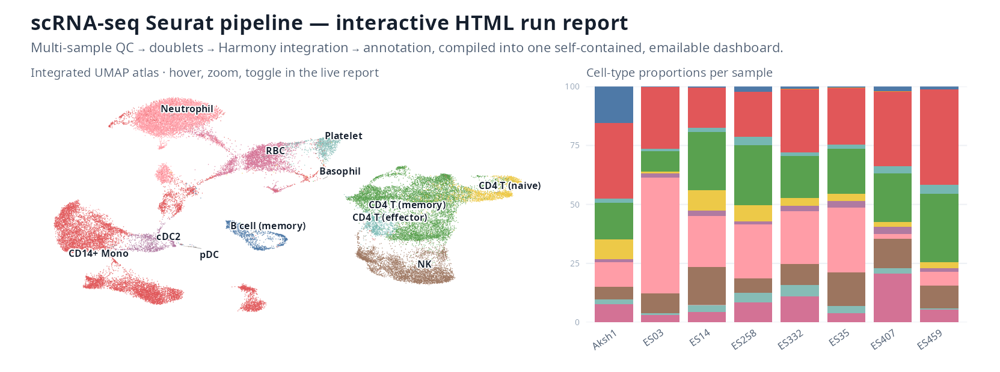

# scRNA-seq Seurat Pipeline

A multi-sample single-cell RNA-seq pipeline built on Seurat v5 and Harmony. It takes count
matrices from MGI's DNBelab C Series (C4) software (or 10x CellRanger) from raw barcodes to an
annotated, integrated atlas, and compiles the whole run into **one self-contained, emailable
HTML report** that a wet-lab scientist can open with a double-click and explore without R, a
server, or an internet connection.

The HTML report is the headline deliverable. Everything upstream exists to fill it:

- **Per-sample UMAP panel grid** — one interactive panel per sample on a shared coordinate
  space. Show or hide samples with chips, expand a single sample to full width, and hover any
  cell for its type. For runs of 8 samples or fewer the panels are live (zoom, pan, legend
  toggle); past 8 they fall back to high-resolution static snapshots so the file still opens.
- **Cell-type proportion tracking** — stacked composition (% of sample) and absolute
  cell-number bars, with in-bar labels, per-type hatch patterns (so the bars read without
  relying on colour), legend toggling, and hover values.
- **Marker dot plot, QC and doublet violins, and per-sample / per-stage galleries** — the
  evidence behind every annotation, one click away in the left nav.

A finished example lives at
`Results/results_Aksh1-ES03-ES14-ES258-ES332-ES35-ES407-ES459_filtered/reports/`
(`results_Aksh1_8samples_report.html`).

Deeper docs: [DOCUMENTATION.md](DOCUMENTATION.md) (architecture and config reference) and
[ReportGuide.md](ReportGuide.md) (how to read every panel in the HTML report).

---

## Quick start (the 10-minute route)

This gets you from a clean clone to a compiled HTML report using the bundled `H1` / `H2`
example data (~1,200 cells, ~15–25 min depending on cores).

**1. Clone and enter the repo.**

```bash
git clone <repo-url> scRNA
cd scRNA
```

**2. Build the conda environment** (R 4.3.3, Seurat 5.1.0, Harmony, SingleR, scDblFinder, and
the rest). Uses `mamba`; takes 10–20 min the first time.

```bash
bash pipeline/setup_env.sh
conda activate scrna_seurat
```

**3. Run the pipeline on the example data.**

```bash
bash pipeline/run_pipeline.sh Samples/H1 Samples/H2
```

`Samples/H1` and `Samples/H2` are human PBMC matrices committed with the repo. Passing two
samples turns on Harmony integration automatically. The interactive HTML report is built at the
end, after the PDFs.

**4. Open the report.** It lands here (default two-sample run name):

```
Results/results_H1-H2_filtered/reports/H1-H2_report.html
```

Double-click it. No server needed; the file is self-contained.

### Run it on your own data

Each sample is a folder holding a count matrix in one of these layouts (the pipeline
auto-detects which). The `filter_matrix/` and `raw_matrix/` layouts are the output of MGI's
[DNBelab C Series HT scRNA analysis software](https://github.com/MGI-tech-bioinformatics/DNBelab_C_Series_HT_scRNA-analysis-software),
which is what every bundled dataset here was generated with:

```
SampleA/
├── filter_matrix/                 # preferred: pre-filtered barcodes (DNBelab C Series output)
│   ├── barcodes.tsv.gz
│   ├── features.tsv.gz
│   └── matrix.mtx.gz
└── raw_matrix/                    # optional: raw, unfiltered barcodes
```

10x CellRanger's own `filtered_feature_bc_matrix/` and `raw_feature_bc_matrix/` are detected
too. Point the runner at any number of sample folders by absolute or relative path:

```bash
# One sample (no integration)
bash pipeline/run_pipeline.sh /path/to/SampleA

# Two or more samples (Harmony integration)
bash pipeline/run_pipeline.sh /path/to/SampleA /path/to/SampleB /path/to/SampleC

# Non-human data: the 'bat' keyword applies Eonycteris spelaea overrides
bash pipeline/run_pipeline.sh bat /path/to/ES03 /path/to/ES12

# Label conditions for the comparison report
bash pipeline/run_pipeline.sh condition="ADay0=healthy,BDay1=recovering" /path/to/A /path/to/B
```

Output is the same shape as the example: a run directory under `Results/` with the HTML report
in its `reports/` subfolder.

---

## Species and tissue

The same pipeline runs human PBMC, human whole blood, and bat whole blood. The species keyword
swaps the SingleR reference, the marker panels, the clustering resolution, and the expected
contamination list, so the HTML report is annotated correctly for the tissue.

| Input | Command | SingleR reference | Clustering | Notes |
|-------|---------|-------------------|------------|-------|
| Human PBMC (default) | `run_pipeline.sh /path/A /path/B` | `HumanPrimaryCellAtlas` (broad) | `0.3–0.8`, default 0.5 | Canonical PBMC marker panel |
| Human whole blood | same, with `SINGLER_REF <- "MonacoImmune"` in `config.R` | `MonacoImmune` (blood-optimised) | `0.3–0.8` | Resolves CD4 / CD8 / γδ T; treat RBC + neutrophils as expected |
| Bat whole blood | `run_pipeline.sh bat /path/A /path/B` | `MonacoImmune` | `0.3–1.0` | `config_species_bat.R` overrides: γδ T, bat-validated markers, RBC + neutrophil contamination |
| Bat wing tissue | `run_pipeline.sh bat_wing /path/A /path/B` | broad atlas | `0.3–0.8` | Adds steps `11`–`14` (wing DEGs, pathways, CellChat, trajectory); no blood-contamination types |

The `bat` and `bat_wing` keywords source `pipeline/config_species_bat.R` after the human base
config, mutating `MARKERS`, `QC`, `SINGLER_REF`, and `CLUSTER` in place. Human whole blood has
no keyword; set `SINGLER_REF <- "MonacoImmune"` in `config.R` if you want blood-optimised
annotation over the broad PBMC default. Either way the report layout, panels, and interactivity
are identical; only the labels and palette change.

---

## What a run produces

Run directory name is `Results/results_<samples>_<filtered|raw>/` (runs of more than 4 samples
abbreviate to `<firstSample>_<N>samples` to stay under the Windows 260-char path limit).

```
Results/results_<...>_filtered/
├── qc/                  # QC violins, scatter, cell_fate.csv
├── doublets/            # scDblFinder score plots
├── individual/          # per-sample UMAP, markers, dot plots
├── integrated/          # integrated_annotated.rds (the atlas), Harmony UMAP, heatmaps
├── annotation/          # SingleR scores, canonical marker feature plots,
│                        #   reference_transfer_cells.csv.gz + _composition.csv (if 05r ran)
├── benchmark/           # concordance.csv, wholeblood_signature.csv, benchmark_report.md (if 08c ran)
├── differential/        # DE tables and plots (multi-sample runs)
├── logs/                # one log per step
├── reports/             # <run>_report.html  +  build_report.log
├── 01-QC_report.pdf
├── 02-Doublet_report.pdf
├── 03-Individual_report.pdf
├── 04-Annotation_report.pdf
├── 05-Integrated_report.pdf
└── Overall_report.pdf   # A4-normalised curated summary
```

---

## Architecture reference (for pipeline operators)

### The numbered steps

`run_pipeline.sh` runs a sequence of standalone R scripts. Each resolves `config.R` from its
own location, so any step can be run on its own.

| Step | Script | Does |
|------|--------|------|
| 01 | `01_load_qc.R` | Load matrices, QC filter (genes / UMI / %MT), write `cell_fate.csv` |
| 02 | `02_doublets.R` | scDblFinder per sample; cache and remove doublets |
| 03 | `03_individual.R` | Per-sample normalise, HVGs, PCA, UMAP, clustering, markers |
| 04 | `04_integrate.R` | Merge and integrate with Harmony |
| 05 | `05_annotate.R` | SingleR + canonical markers → cell-type labels; T-cell sub-clustering |
| 05r | `05r_reference_transfer.R` | Optional: transfer run-independent `cell_type_ref` labels from a frozen reference (gated on `REFERENCE_MODEL`) |
| 06 | `06_visualize.R` | Integrated UMAPs, proportion plots, marker dot plots |
| 06b | `06b_differential.R` | Differential expression across conditions (multi-sample) |
| 07 | `07_finalize_reports.R` | Assemble the per-stage PDFs and `Overall_report.pdf` |
| 08 | `08_comparison_report.R` | Optional cross-condition comparison report |
| 08b | `08b_html_report.R` | The interactive HTML report (auto-built at the end of a run) |
| 08c | `08c_benchmark_concordance.R` | Optional: cross-run anchor benchmark vs the frozen baseline + whole-blood sort readout (gated on `REFERENCE_MODEL`) |

Default step set: multi-sample runs do `01 02 03 04 05 06 06b 07`; single-sample runs do
`01 02 03 04 05 06 07` (no DE). Then 08b runs automatically **if**
`integrated/integrated_annotated.rds` exists (so single-sample runs, which skip integration,
skip the HTML report). Run a subset by appending step numbers:

```bash
bash pipeline/run_pipeline.sh /path/to/A /path/to/B 05 06 07
bash pipeline/run_pipeline.sh --no-report /path/to/A /path/to/B   # skip the HTML build
```

The bat-wing project adds steps `11`–`14` (wing DEGs, pathways, CellChat, trajectory) under
`pipeline/projects/bat_wing/`, triggered by the `bat_wing` species keyword.

When a frozen reference is configured (`SCRNA_REFERENCE_MODEL`), `05r` runs right after `05`
(so the PDFs and HTML pick up run-independent labels) and `08c` runs at the end. Both self-skip
when no model is set and never fail the run, so they are invisible on a default human run.

### Run-independent labels and cross-run benchmark (frozen reference)

De-novo annotation is run-relative: the same sample gets different cell-type proportions in
different runs, because clustering and the SingleR/scType consensus are recomputed over whatever
samples are in the run. On cross-species data this also mislabels (bat neutrophils collapse into
CD14+ Mono at the human Neutrophil/Monocyte boundary), so a sample can read 0% neutrophils in one
run and 25% in another.

The frozen reference fixes both. `build_reference.R` trains a SingleR classifier once from a
canonical annotated run and saves a model bundle under `Results/frozen_reference/`. On any later
run, `05r_reference_transfer.R` classifies every cell against that fixed model and writes a
second label column, `cell_type_ref`, that does not depend on the run's sample mix. `08c` then
checks the shared anchor samples against the model's baseline and flags drift over 5 pp; in
practice the anchors reproduce within ~2.3 pp across different batches.

To turn it on, build a reference once and point runs at it:

```bash
# build once from a finished, well-annotated run
SCRNA_SPECIES=bat Rscript pipeline/build_reference.R \
  Results/results_<canonical-run>_filtered --holdout=Aksh1,ES332

# every subsequent run: set the model; 05r + 08c run automatically
SCRNA_SPECIES=bat SCRNA_REFERENCE_MODEL=Results/frozen_reference/<model>.rds \
  bash pipeline/run_pipeline.sh bat /path/A /path/B
```

In the HTML report the bars and UMAP default to `cell_type_ref` with a **Frozen reference vs
De-novo** toggle, and a **Frozen-reference benchmark** section shows the concordance and the
per-sample whole-blood signature. The proportion PDFs (`06`, `09`) print `Labels: frozen
reference` in the subtitle. Full design: [`docs/frozen_reference_scope.md`](docs/frozen_reference_scope.md).

### Config drift protection: `validate_config.R`

Before any step runs, `run_pipeline.sh` calls `pipeline/validate_config.R`, which sources
`config.R` and fails fast (exit 1) on the config mistakes that otherwise surface hours into a
run:

- every cell type in `CLUSTER_CELLTYPE_MAP` has a colour in `CELLTYPE_COLORS`;
- `CLUSTER_CELLTYPE_MAP` keys are cluster numbers, not labels;
- sample paths exist (a warning by default so config-only checks pass on an unmounted NAS;
  `--strict-paths` escalates it to an error).

### The caching engine: `sample_cache/`

Per-sample work (QC and doublet detection) is cached in `sample_cache/`. The cache key
fingerprints the 10x matrix files (size + mtime) alongside the QC parameters, so changing an
input or a threshold busts the cache while re-running the same inputs reuses it. For inputs the
fingerprint can't read, the key degrades to (parameters + path). This is what lets you re-run
step 05 onward repeatedly during annotation without recomputing 01–04.

### Tuning knobs (all in `pipeline/config.R`)

| What | Where | Default |
|------|-------|---------|
| Dimensionality | `DIM$npcs`, `DIM$dims_use` | 30 PCs, dims 1:20 |
| Clustering | `CLUSTER$resolutions`, `CLUSTER$default_res` | `c(0.3,0.4,0.5,0.6,0.8)`, 0.5 |
| Side-by-side resolutions | `CLUSTER$compare_res` | `c(0.5,0.6,0.8)` |
| T-cell sub-clustering | `SUBCLUSTER$enabled`, `$resolution`, `$min_cells` | TRUE, 0.8, 20 |
| Harmony | `HARMONY$theta`, `$lambda`, `$nclust` | 2, 1, 50 |
| QC thresholds | `QC` | see file |
| Palette / labels | `CELLTYPE_COLORS`, `CLUSTER_CELLTYPE_MAP` | see file |

**Resource allocation** is governed automatically in `config.R$PARALLEL`: a RAM governor sizes
the worker pool from available memory and core count, capped at `min(8, detectCores() - 2)`,
budgeting ~8 GB/worker in the per-sample phase and ~16 GB/worker in the merged phase. To go
wider or narrower, edit `.future_mem_gb` / `.merge_mem_gb` in that block. `run_pipeline.sh`
pins BLAS/OMP to one thread per process so workers don't oversubscribe cores.

**Environment overrides** (no config edit needed): `SCRNA_BASE_DIR` (relocate the project
root), `SCRNA_SAMPLE1..N` (sample paths), `SCRNA_SPECIES` (`human` / `bat`), `SCRNA_CONDITION`
(`name=label,...`), `SCRNA_RESULTS_DIR` (point a step at an existing run dir to re-render its
PDFs/reports without re-listing samples). Frozen-reference knobs: `SCRNA_REFERENCE_MODEL` (path
to the model bundle; turns on `05r`/`08c`), `SCRNA_ANCHORS` (benchmark control samples, default
`Aksh1,ES332`), `SCRNA_DRIFT_PP` (drift-flag threshold, default 5). The wrapper sets the common
ones for you from its CLI args.

**Report downsampling** is a flag on the HTML build, not a config edit. The plotting frame is
capped per sample (default 6,000 cells) for a responsive file; proportion and count bars always
use the full data. See the re-render runbook below.

---

## Runbooks

### Re-render the HTML report without recomputing anything

Layout, styling, and downsampling live entirely in step 08b. To change them on a finished run,
re-render straight from the saved `integrated_annotated.rds` and tables. No clustering, no
integration, seconds not hours:

```bash
bash pipeline/build_report.sh <run_dir>

# examples
bash pipeline/build_report.sh Results/results_H1-H2_filtered
bash pipeline/build_report.sh Results/results_H1-H2_filtered --max-cells=4000
bash pipeline/build_report.sh Results/results_H1-H2_filtered --samples=H1,H2
```

`--max-cells=N` sets the per-sample plotting cap (default 6000); `--samples=A,B` restricts the
report to a subset. Output and a `build_report.log` land in `<run_dir>/reports/`. For a big run
you can detach it:

```bash
nohup bash pipeline/build_report.sh <run_dir> &   # poll <run_dir>/reports/build_report.log
```

### Fix or refine the cell-type annotation

Annotation is the one step that usually needs a human pass:

1. Open `<run_dir>/annotation/canonical_markers_dotplot.pdf`.
2. Fill in `CLUSTER_CELLTYPE_MAP` in `pipeline/config.R` (cluster number → label).
3. Re-run the downstream steps only:

   ```bash
   bash pipeline/run_pipeline.sh /path/to/A /path/to/B 05 06 07
   ```

Steps 01–04 come from `sample_cache/`, so this is fast.

### Common issues

| Symptom | Cause / fix |
|---------|-------------|
| `Environment 'scrna_seurat' not found` | Run `bash pipeline/setup_env.sh`, then `conda activate scrna_seurat`. |
| HTML report skipped at the end of a run | No `integrated/integrated_annotated.rds` — that's expected for single-sample runs (no integration). |
| `CONFIG VALIDATION FAILED` | Read the printed errors: a label is missing from `CELLTYPE_COLORS`, or a `CLUSTER_CELLTYPE_MAP` key isn't a cluster number. |
| Sample path warnings | Data lives on an unmounted NAS; mount it, or pass `--strict-paths` to turn the warning into a hard error. |
| Report too large / slow to open | Re-render with a lower `--max-cells`, or it will already be static snapshots past 8 samples. |

---

## Requirements

- Linux or macOS, conda or mamba.
- ~16 GB RAM for two small samples; more for larger or many-sample runs (the RAM governor
  scales workers to fit).
- The conda environment from `pipeline/setup_env.sh`: R 4.3.3, Seurat 5.1.0, Harmony, SingleR,
  celldex, scDblFinder, DESeq2, clusterProfiler, plus CellChat v2 / monocle3 / SeuratWrappers
  for the bat-wing extension.

## License

MIT License — see [LICENSE](LICENSE).
