# scRNA-seq Pipeline — Report Interpretation Guide

This guide describes every plot generated by the pipeline, what it shows, and how to interpret good vs poor results. Reports are produced in `results_*/reports/`. Example images are from the H1+H2 dataset.

### New to single-cell? How to read these reports

Single-cell RNA-seq turns a tissue into a table of cells × genes. The pipeline's job is to (1) throw out junk cells, (2) group the rest into **clusters** of similar cells, and (3) put a biological name on each cluster. Almost every plot here is one of two views:

- A **UMAP** — a 2D map where each dot is a cell and nearby dots have similar expression, so clusters appear as separated islands. Colour the same map by cluster, by sample, by a single gene, or by cell-type label to ask different questions.
- A **dot plot / heatmap / violin** — expression of chosen genes across clusters or cell types, to check *which* genes define a group.

Read the reports in order: **QC** (are the cells real?) → **doublets** (remove fused cells) → **individual** (does each sample cluster sensibly?) → **annotation** (what are the clusters?) → **integrated** (do samples agree, and how do compositions differ?).

**Key terms:** **UMI** = one captured transcript; **nFeature** = genes detected in a cell; **HVG** = highly variable gene (the informative ones used for clustering); **doublet** = two cells caught in one droplet; **cluster** = a group of transcriptionally similar cells (a number, e.g. "cluster 3"); **annotation** = giving a cluster a cell-type name; **marker** = a gene whose expression flags a cell type (e.g. CD3D → T cells).

| Report file | Contents |
|-------------|----------|
| `01-QC_report.pdf` | QC violin + scatter plots per sample |
| `02-Doublet_report.pdf` | scDblFinder UMAP + score histograms |
| `03-Individual_report.pdf` | QC + per-sample UMAP, HVG, PCA, markers |
| `04-Annotation_report.pdf` | SingleR heatmap, label UMAP, scType labels + consensus, canonical dot plot, contamination summary |
| `05-Integrated_report.pdf` | Harmony, integrated UMAP, heatmap, composition; split-by-sample UMAP paginated (≤2/page) |
| `Overall_report.pdf` | A4-normalised curated summary — one plot per page with title banner + interpretation caption; includes all split-UMAP pages for 3+ samples |
| `Comparison_report.pdf` | Step 08 standalone cross-sample report (quality, doublets, composition, UMAP, DE) |

---

## 01-QC_report.pdf

### 1. QC Violin Plot — nFeature / nCount / %MT

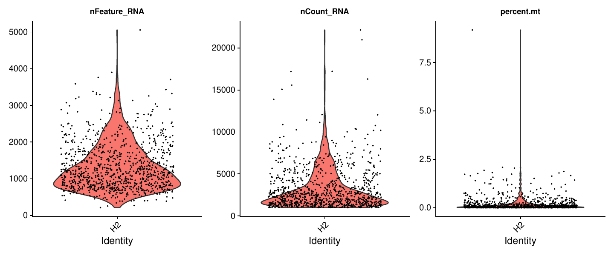

**What it shows:** Distribution of three per-cell metrics across all cells in a sample:
- **nFeature_RNA** — number of unique genes detected per cell
- **nCount_RNA** — total UMI (transcript) count per cell
- **percent.mt** — percentage of counts from mitochondrial genes

**How to interpret:**

| Metric | Good quality | Poor quality |
|--------|-------------|--------------|
| nFeature_RNA | Unimodal, 500–4000 range, narrow spread | Very low peak (<200) = empty droplets; very high tail (>6000) = doublets |
| nCount_RNA | Roughly proportional to nFeature; smooth distribution | Bimodal distribution suggests mixed quality populations |
| percent.mt | Low median (<10%), compact distribution | High median (>20%) = dying cells releasing mitochondrial RNA |

**Red flags:** A large population at nFeature < 200 means many empty droplets survived cell-calling. A long right tail with nFeature > 6000 suggests doublets not caught by the cell ranger filter.

---

### 2. QC Scatter — UMI vs Genes & UMI vs %MT

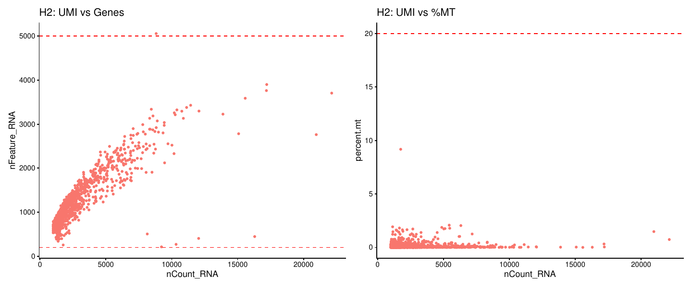

**What it shows:** Two scatter plots per sample:
- **Left:** nCount_RNA (x) vs nFeature_RNA (y) — relationship between transcript count and gene diversity
- **Right:** nCount_RNA (x) vs percent.mt (y) — relationship between library size and mitochondrial contamination

Red dashed lines mark the QC thresholds from `config.R`.

**How to interpret:**

**Left plot (UMI vs Genes):**
- Good: A tight linear diagonal band — more UMIs correlate with more genes detected
- High UMI but low genes (bottom-right outliers) = potential doublets or cells with few highly expressed genes
- Low UMI and low genes (bottom-left cluster) = empty droplets or dead cells — should fall below the threshold lines

**Right plot (UMI vs %MT):**
- Good: Most cells form a horizontal band with low %MT (<10%), regardless of UMI count
- Cells with high %MT and low UMI (top-left) = lysed/dying cells — mitochondrial transcripts dominate because cytoplasmic mRNA has leaked out
- A diagonal band rising with UMI = ambient RNA contamination

**After filtering:** Only cells within the threshold rectangle (between all dashed lines) are retained.

---

## 02-Doublet_report.pdf

### 3. Doublet UMAP — scDblFinder Classification

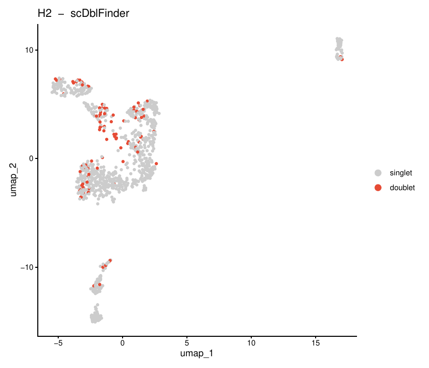

**What it shows:** UMAP embedding of a single sample (computed in step 02 for visualisation only), with cells coloured by doublet classification: grey = singlet, red = doublet.

**How to interpret:**
- Good: Doublets (red) appear at the **boundaries or intersections** of clusters — these are mixed-identity cells captured together in the same droplet, so they plot between two parent populations
- Poor: Doublets scattered randomly throughout all clusters = the classifier may be miscalibrated, or the doublet rate parameter is incorrect
- A cluster that is entirely red = a real biological population that resembles doublets (e.g. transitional cell states); review manually before adjusting thresholds

**Action:** If doublet rate seems off (e.g. >15% or <1%), update `DOUBLET$doublet_rate` in `config.R` for that sample.

---

### 4. Doublet Score Histogram

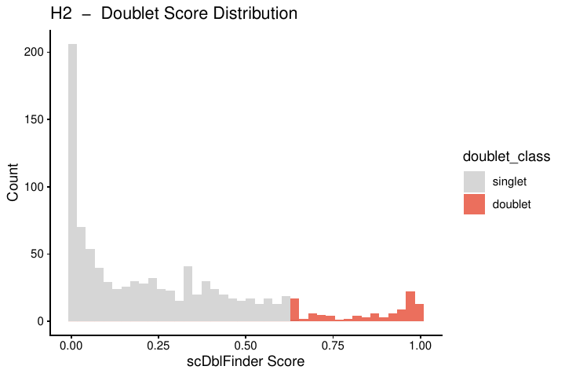

**What it shows:** Distribution of scDblFinder probability scores for all cells. The score ranges 0–1 (higher = more likely doublet). Bars are split by final classification (singlet/doublet).

**How to interpret:**
- Good: Bimodal distribution — a large peak near 0 (singlets) and a smaller peak near 1 (doublets), with a clear valley between them
- Poor: A single broad peak with no clear separation = scDblFinder cannot distinguish doublets from singlets (often happens with very small datasets or low-quality libraries)
- The threshold between singlet/doublet is automatically set by scDblFinder; the histogram lets you verify the split is sensible

---

## 03-Individual_report.pdf

*(One set of plots per sample)*

### 5. Highly Variable Genes (HVG) Plot

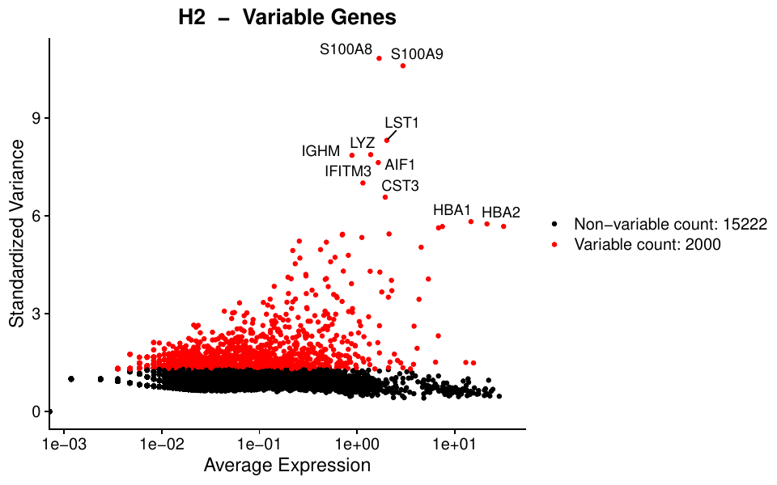

**What it shows:** All genes plotted by average expression (x) vs standardised variance (y). The top 2000 most variable genes (used for PCA) are highlighted in red; the rest are grey. Top 10 HVGs are labelled.

**How to interpret:**
- Good: A smooth dispersion curve, with immune marker genes (CD3D, CD14, MS4A1, NKG7, etc.) appearing among the top HVGs — this confirms the data captures biologically meaningful variability
- Poor: No clear separation between variable and non-variable genes, or only ribosomal/mitochondrial genes in the top 10 = normalisation may have failed, or data quality is low
- Very few HVGs selected = low library complexity; consider lowering `NORM$n_hvg` in `config.R`

---

### 6. PCA Elbow Plot

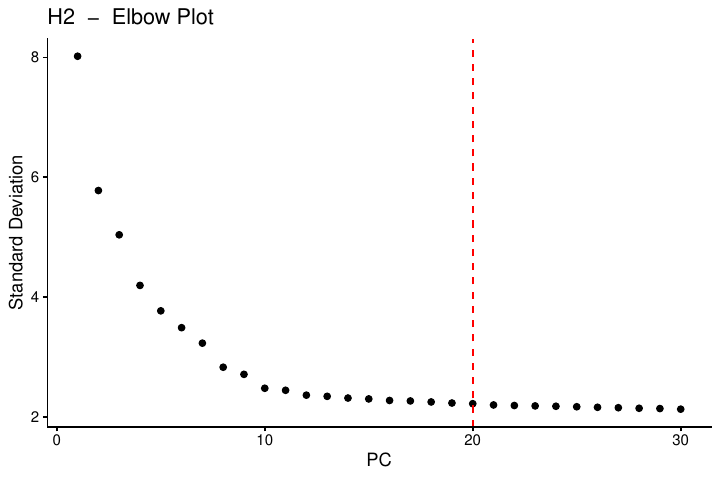

**What it shows:** Standard deviation explained by each principal component (PC), ordered 1–50. The red dashed line marks `DIM$dims_use` — the PCs passed to UMAP and clustering.

**How to interpret:**
- Good: A clear "elbow" where the curve flattens, with the cutoff line sitting just past that elbow (typically PC 10–20 for PBMC data)
- The elbow represents the point where additional PCs capture mostly noise rather than biological signal
- Poor: No elbow — the curve declines linearly = the dataset may lack clear cell populations, or QC filtering was insufficient
- If the elbow is at PC 5 but you're using 20 PCs, downstream clustering may be noisy; reduce `DIM$dims_use`

---

### 7. PC Heatmaps (Dims 1–9)

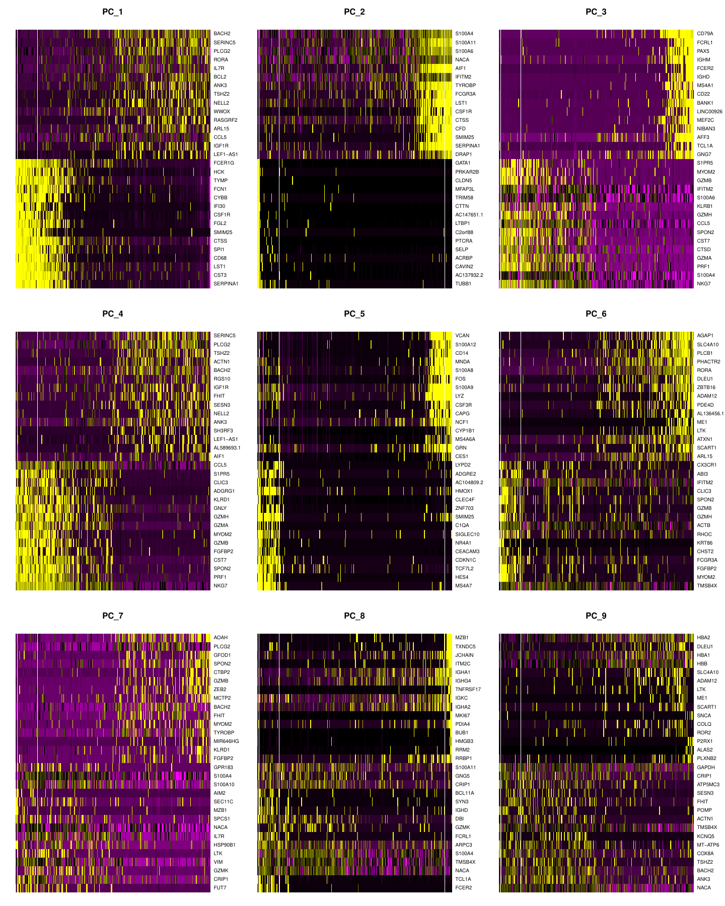

**What it shows:** For each of the first 9 PCs, a heatmap of the top and bottom contributing genes across a random sample of cells. Cells are ordered by PC score; genes with the highest positive and negative loadings are shown.

**How to interpret:**
- Good: Each PC shows a distinct set of marker genes with a clear gradient from high to low scores across cells — this means each PC captures a biologically coherent axis of variation
- PC1 often separates T cells from monocytes; PC2 may separate NK from B cells, etc.
- Poor: PCs dominated by ribosomal genes (RPL*, RPS*) or heat-shock genes (HSPA*, HSP90*) = technical rather than biological variation; consider regressing these out via `ScaleData`
- A PC where the heatmap is nearly uniform (no gradient) = that PC is noise; exclude it from `DIM$dims_use`

---

### 8. UMAP — Clusters (per sample)

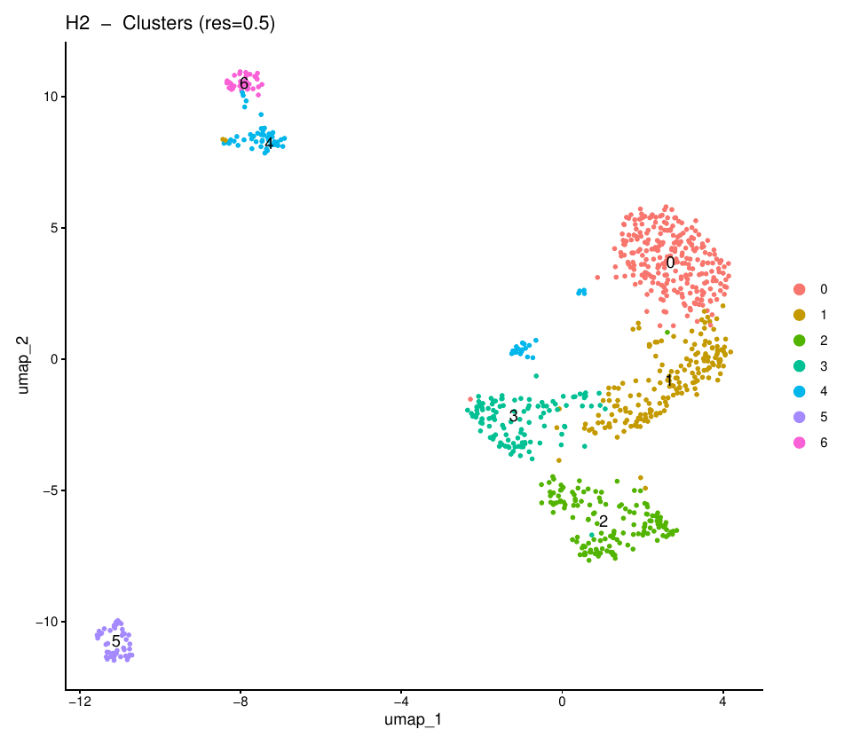

**What it shows:** UMAP embedding of a single sample coloured by Seurat cluster identity, with cluster numbers labelled.

**How to interpret:**
- Good: Distinct, compact, well-separated clusters — each corresponds to a candidate cell type
- Poor: All cells in one blob with no structure = too few PCs used, or the sample has very low diversity; increase `DIM$dims_use` or lower `CLUSTER$default_res`
- Many tiny clusters = resolution too high; lower `CLUSTER$default_res`
- Clusters that appear to merge or overlap are likely related cell types (e.g. CD4 and CD8 T cells may be adjacent before annotation)

---

### 9. Top Marker Dot Plot (per sample)

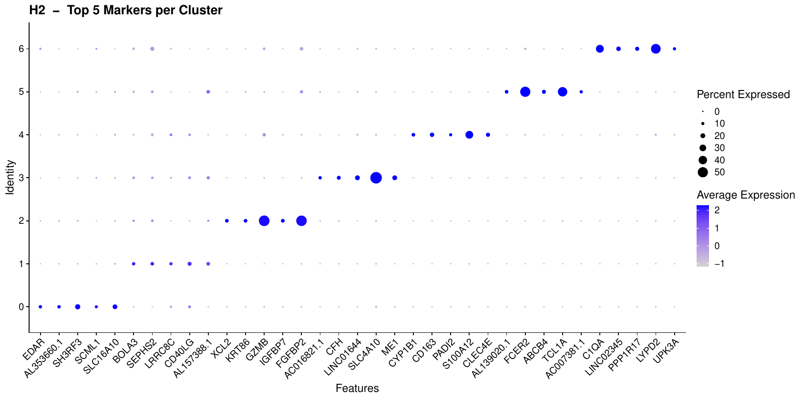

**What it shows:** Top 5 differentially expressed genes per cluster (by log2 fold-change), plotted as a dot plot. Dot size = % of cells expressing the gene; dot colour = average normalised expression.

**How to interpret:**
- Good: Each cluster has a distinct set of marker genes not shared with others — confirms clusters are biologically meaningful
- Poor: Marker genes are shared across many clusters, or fold-changes are very low (<0.5) = clusters may not be well-resolved; try increasing resolution or using more PCs
- Ribosomal or mitochondrial genes appearing as top markers = these were not regressed out and are driving spurious clustering

---

### 10. Canonical Marker Feature Plots (per sample)

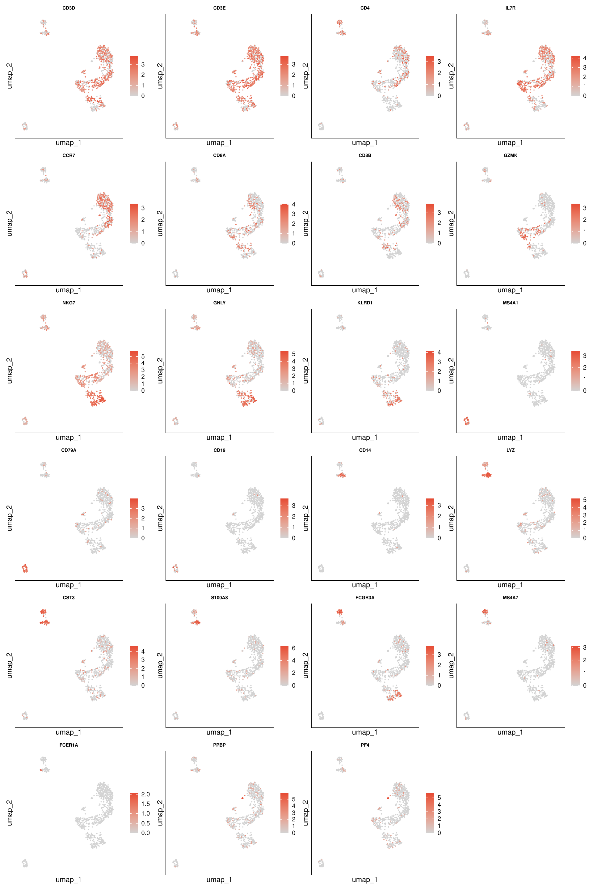

**What it shows:** UMAP plots with gene expression overlaid for canonical PBMC markers. Each panel shows a single gene; grey = low/no expression, red = high expression.

**How to interpret:**
- Good: Each marker is enriched in a specific region of the UMAP, confirming cell type identity — e.g. CD3D high in T cell clusters, MS4A1 high in B cell clusters, CD14 high in monocyte clusters
- Poor: All markers show diffuse, uniform expression across the UMAP = normalisation failed or data is very noisy
- Co-expression of mutually exclusive markers in the same cells (e.g. CD3D + CD14) = those cells are likely doublets

---

## 04-Annotation_report.pdf

### 11. SingleR Score Heatmap

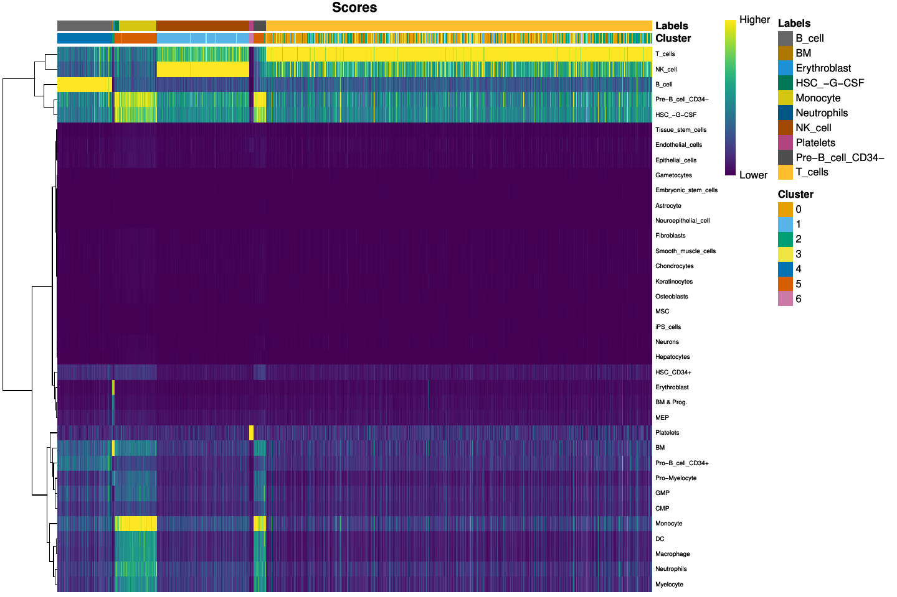

**What it shows:** A heatmap of SingleR reference scores for each cell (columns) against each reference cell type (rows). The colour represents how closely each cell matches a given reference cell type. Cells are annotated by cluster along the top.

**How to interpret:**
- Good: Each column (cell) shows a clear high score (bright) for one reference type and low scores for all others — sharp, specific annotation
- Poor: Many cells with uniformly moderate scores across multiple types = ambiguous annotations; these will be pruned and labelled "Unassigned"
- Clusters that align cleanly with one reference type = high-confidence automated annotations; clusters with mixed scores require manual inspection

---

### 12. SingleR Labels UMAP

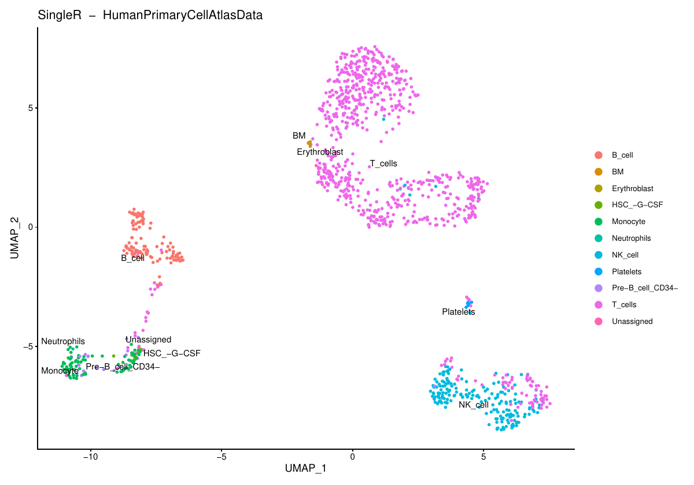

**What it shows:** UMAP embedding coloured by the pruned SingleR label for each cell. Cells labelled "Unassigned" had insufficient confidence.

**How to interpret:**
- Good: SingleR labels align with the visual clusters on the UMAP, and labels match expected cell types for the tissue (T cells, NK cells, B cells, Monocytes for PBMC)
- Poor: Labels are scattered randomly with no spatial coherence on the UMAP = the reference dataset may not match the tissue type; consider changing `celldex` reference
- Many "Unassigned" cells in a cluster = that population is not well-represented in the reference; check `logs/05_annotate.log` for the auto-generated map and override those clusters in `CLUSTER_CELLTYPE_MAP`

---

### 13. SingleR Delta Score UMAP

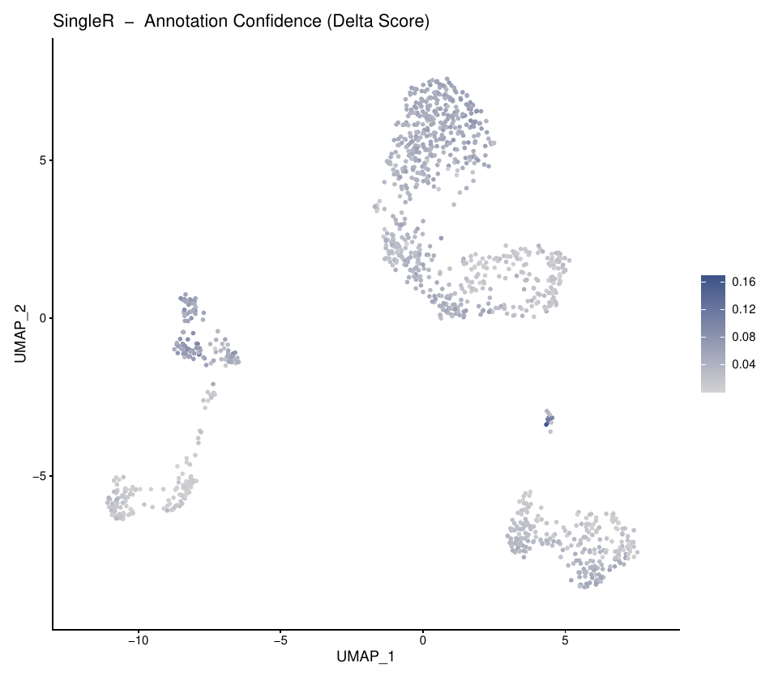

**What it shows:** UMAP coloured by the SingleR delta score — the difference between the top and second-best reference scores. Higher delta = more confident annotation.

**How to interpret:**
- Good: Cells that belong to well-defined clusters have high delta scores (dark blue); cells at cluster boundaries or in heterogeneous regions have low delta scores
- Poor: All cells have low delta scores (<0.1) = the reference cannot discriminate between cell types in this dataset
- Use this plot to identify which clusters need manual review: clusters with systematically low delta scores are candidates for "Unassigned" even if SingleR assigned a label

---

### 13b. scType Labels & Consensus Auto-annotation

**What it shows:** Alongside SingleR (a reference-atlas method), the pipeline runs **scType** — a marker-based scorer that needs no reference transcriptome, only the `MARKERS` gene lists. `sctype_labels_umap.pdf` colours the UMAP by scType's per-cluster call; `singler_vs_sctype_comparison.csv` and `consensus_annotation.csv` tabulate the two methods side by side.

**How to use:**
- The two methods are independent (reference-based vs marker-based). Where they **agree**, the call is high-confidence; where they **disagree**, the cluster needs your eye.
- `consensus_annotation.csv` makes this explicit: each cluster is marked `AUTO` (both agree) or `REVIEW` (they differ), and `logs/05_annotate.log` prints a **pre-filled `CLUSTER_CELLTYPE_MAP`** with `REVIEW` markers on the ambiguous clusters.
- Workflow: paste that pre-filled map into `config.R`, resolve only the `REVIEW` rows using the dot plot below, then re-run steps 05–07. This replaces eyeballing every cluster with adjudicating the few the two methods disagree on — typically a handful for PBMC / whole blood.

---

### 14. Canonical PBMC Markers Dot Plot (for annotation review)

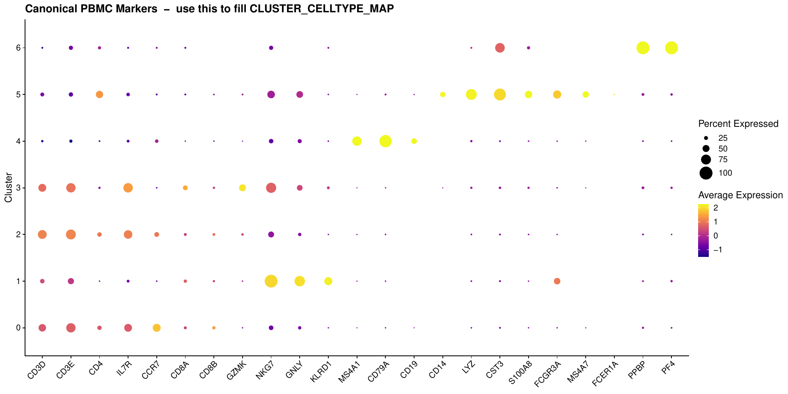

**What it shows:** Canonical marker genes for all major PBMC cell types, plotted against Seurat clusters. Use this to verify or correct the auto-generated `CLUSTER_CELLTYPE_MAP` from the log.

**How to use:**
1. Open `consensus_annotation.csv` (or `logs/05_annotate.log`) for the pre-filled map — clusters marked `AUTO` are agreed by both SingleR and scType; only the `REVIEW` clusters below need a decision
2. Open this dot plot and verify each cluster's label against its marker expression:
   - **CD3D, CD4, CCR7, TCF7, LEF1** → CD4 T (naive)
   - **CD3D, CD4, GZMK, TNFRSF4** → CD4 T (effector/memory)
   - **CD3D, CD8A, CD8B, GZMK** → CD8 T
   - **TRGC1, TRGC2** → γδ T cell
   - **NKG7, GNLY, KLRD1, GZMB** → NK
   - **MS4A1, CD79A, IGHD, TCL1A** → B cell (naive)
   - **MS4A1, CD79A, IGHG1/G2, IGHA1** → B cell (memory)
   - **CD14, LYZ, S100A8** → CD14+ Mono
   - **FCGR3A, MS4A7, CDKN1C** → FCGR3A+ Mono
   - **FCER1A, CLEC10A, FLT3** → DC
   - **S100A8, S100A9, S100A12, BST1** → Neutrophil
   - **PPBP, PF4** → Platelet
3. Copy the suggested map from the log into `config.R`, correcting any wrong labels
4. Re-run steps 05–07: `bash pipeline/run_pipeline.sh <samples> 05 06 07`

> **Note:** Cluster numbers differ between datasets — never reuse a map from a different sample run.

---

### 15. Feature Plots — Cell Type Marker Groups

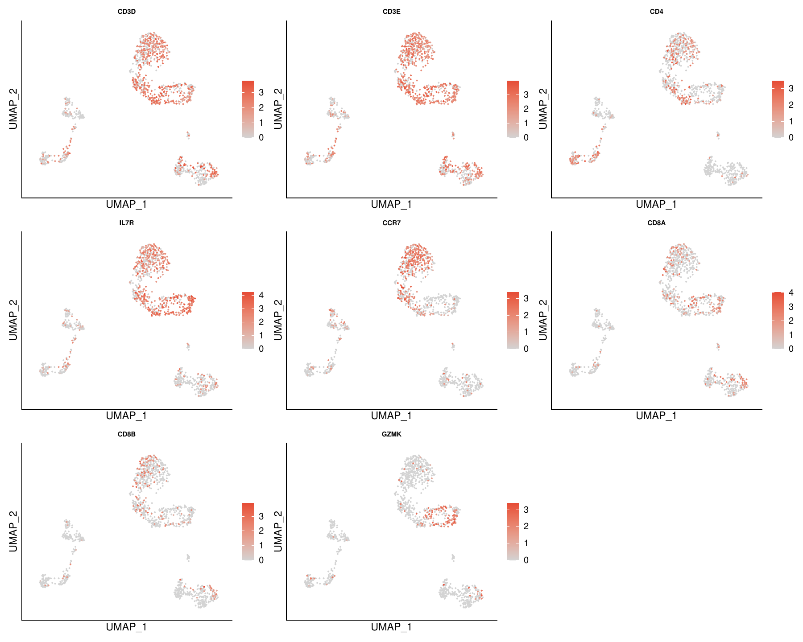

**What it shows:** Individual UMAP feature plots for each canonical marker group (T cells, NK, B cells, Monocytes, DC/Platelets). Same interpretation as plot 10 but focused on specific lineages for annotation.

**How to use:** Identify which UMAP region each lineage marker concentrates in, then cross-reference with the cluster UMAP (plot 8) to assign cluster-to-cell-type mappings.

---

### 16. Cell Type UMAP (post-annotation)

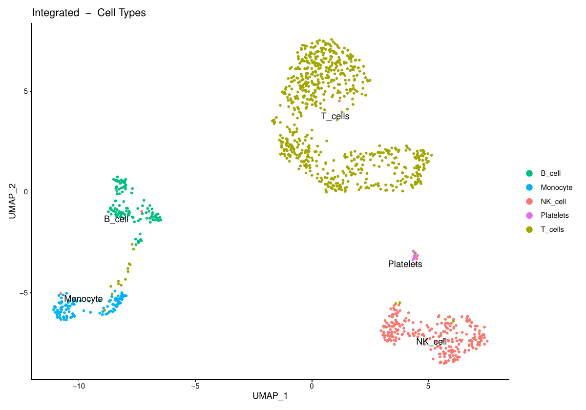

**What it shows:** UMAP coloured by the final assigned cell type labels, either from `CLUSTER_CELLTYPE_MAP` (manual) or SingleR majority vote (automatic).

**How to interpret:**
- Good: Spatially coherent cell type regions that match prior knowledge (T cells adjacent to NK cells; B cells separate; monocytes forming a distinct arm)
- Poor: Cell types intermixed with no spatial separation = annotation may be incorrect, or clusters are not well-resolved; re-run with adjusted resolution

---

### 17. DC / Monocyte Subtype Check

**File:** console output in `logs/05_annotate.log`

**What it shows:** Per-cluster percentage of cells expressing DC markers (FCER1A, CLEC9A) and monocyte subtype markers (CD14 vs FCGR3A). Printed to the log by `05_annotate.R` PART 4.

**How to interpret:**
- Good: Two distinct monocyte clusters — one with high CD14 (classical CD14+ Mono) and one with high FCGR3A (non-classical CD16+ Mono)
- DC absent (<1%): Normal for small healthy PBMC samples; Ficoll-purified PBMCs are often DC-depleted
- DC present (>1%): Confirm with FCER1A/CLEC9A feature plots; these are rare and biologically important
- If CD14 and FCGR3A co-express in the same cluster = monocyte subtypes are not resolved; increase `CLUSTER$default_res` to 0.6–0.8 and re-run

**Action:** If the log warns `"Consider splitting monocyte cluster"`, increase resolution in `config.R` and re-run steps 04–07.

---

### 18. T Cell Sub-cluster UMAP & Dot Plot

**Files:** `annotation/tcell_subclusters_umap.pdf`, `annotation/tcell_subclusters_dotplot.pdf`, `annotation/tcell_subcluster_summary.csv`

**What it shows:** T cell clusters (identified by `SUBCLUSTER$t_patterns`) are sub-clustered at higher resolution using `FindSubCluster()`. The UMAP shows sub-cluster identity; the dot plot shows CD4/CD8/Treg marker expression per sub-cluster.

**How to interpret:**
- Good: Sub-clusters separate into CD4 T (CD4+, IL7R+), CD8 T (CD8A+, GZMK+), and optionally Treg (FOXP3+, IL2RA+) groups with distinct marker expression
- Over-split: Many sub-clusters with nearly identical marker profiles = `SUBCLUSTER$resolution` too high; lower to 0.6–0.8
- Under-split: All sub-clusters share the same markers = resolution too low or T cells in this dataset are not transcriptionally heterogeneous

**Action:** After reviewing this plot, add CD4/CD8/Treg sub-cluster labels to `CLUSTER_CELLTYPE_MAP` in `config.R` and re-run steps 05–07.

---

### 18b. Contamination & Rare Cell Types Summary

**File:** `annotation/contamination_summary.pdf`

**What it shows:** Stacked bar chart of contamination/rare cell counts per sample for each type in `CONTAMINATION_TYPES` (Neutrophil, RBC, HSPC, Platelet, Basophil, Eosinophil, Mast cell). Counts come from the per-cell SingleR contamination override applied after cluster majority-vote labelling.

**How to interpret:**
- Zero counts for all types = clean PBMC preparation — no contamination detected
- Neutrophils present: donor may be inflamed, or sample was processed slowly at room temperature (neutrophils lyse quickly but may persist in small numbers)
- RBC present (HBB/HBA1+ Erythrocytes): Ficoll gradient incomplete; these cells should be absent in healthy PBMC
- HSPC (CD34+): sample is not pure PBMC — possible bone marrow contamination or G-CSF mobilised blood
- Platelet counts: a small number is normal; a large cluster suggests platelet aggregation during isolation
- Compare counts across samples: a sample with 10× more Neutrophils than others likely had a slower processing time or an inflamed donor

---

## 05-Integrated_report.pdf

### 19. Cluster Resolution Comparison — UMAP at Multiple Resolutions

**File:** `integrated/cluster_resolution_comparison.pdf`

**What it shows:** Side-by-side UMAP panels at each resolution listed in `CLUSTER$compare_res` (default: 0.5, 0.6, 0.8). Each panel labels clusters by number and shows the total cluster count in the title.

**How to interpret:**
- Good: Increasing resolution progressively splits larger clusters into biologically coherent sub-types (e.g. one T cell blob at res=0.5 splits into CD4/CD8 sub-groups at res=0.8)
- Poor: Resolution increase only adds tiny isolated clusters at the periphery = the data doesn't support further splitting; stick with lower resolution
- Use this plot to select `CLUSTER$default_res` before re-running annotation (step 05)

---

### 20. Harmony Integration — Before vs After

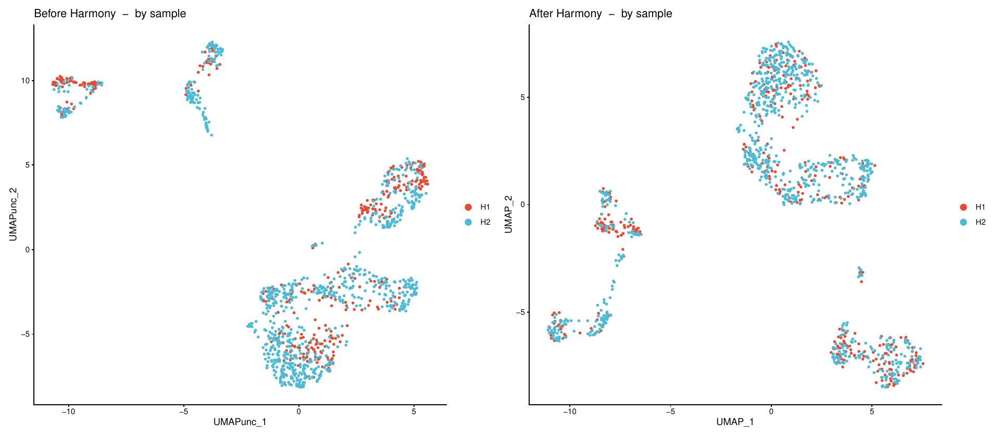

**What it shows:** Side-by-side UMAP plots of the merged dataset coloured by sample: left = before Harmony, right = after Harmony.

**How to interpret:**
- Good (before): Samples form separate, non-overlapping clouds — this is expected batch effect; without correction, samples cluster by donor rather than cell type
- Good (after): Samples intermix thoroughly within each cluster — cells of the same type from different donors overlap, while distinct cell populations remain separated
- Poor (after): Samples still separate after Harmony = strong batch effect that Harmony couldn't resolve; try increasing `HARMONY$theta` in `config.R` (default 2; try 3–5)
- Over-correction: All structure lost and cells form one undifferentiated blob = theta too high; reduce it

---

### 21. Harmony Mixing Quality — Per-cluster Sample Composition

**File:** console output in `logs/04_integrate.log`

**What it shows:** For each Seurat cluster, the maximum percentage of cells coming from a single sample. Printed to the log after Harmony integration in `04_integrate.R`.

**How to interpret:**
- Good: No cluster exceeds 80% from one sample — cells of the same type from different donors are well-mixed
- Warning (>80%): One or more clusters are dominated by a single sample — this cluster may represent a donor-specific cell state, or Harmony integration was insufficient
- If WARNING is emitted, the log suggests increasing `HARMONY$theta` by 2–4 (e.g. from 2 → 4–6)
- Note: Some biological clusters (e.g. a cell type absent in one donor) will naturally be 100% from one sample — confirm with the cell type UMAP before increasing theta

---

### 22. Integrated UMAP — Split by Sample

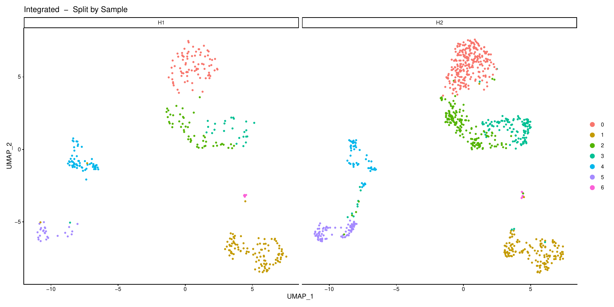

**What it shows:** One UMAP panel per sample, all using the same integrated embedding. Cells are coloured by annotated cell type. Panels are arranged ≤2 per page with a single shared legend on the right (extracted from the full merged object so all cell types are represented). For 3+ samples the plot spans multiple pages — all pages appear in `05-Integrated_report.pdf` and `Overall_report.pdf`.

**How to interpret:**
- Good: Each sample shows similar cluster proportions and spatial arrangement — biological populations are reproducible across donors
- Poor: One sample lacks certain clusters entirely = that cell type may be absent in that donor (biological) or the sample quality was poor (technical); cross-reference with QC metrics
- Very different cluster sizes between samples = either biological variation in cell type composition, or a batch effect that was not fully corrected
- Contamination types (Neutrophil, RBC, HSPC, Platelet, Basophil, Eosinophil, Mast cell) are shown even when they are a minority within a cluster — use their presence per sample to identify quality differences

---

### 23. Integrated UMAP — Clusters

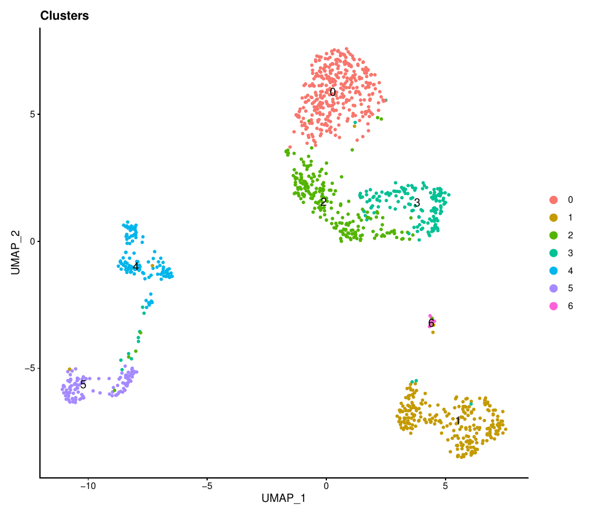

**What it shows:** UMAP of the integrated dataset coloured and labelled by Seurat cluster.

**How to interpret:** Same as plot 8 but for the merged, batch-corrected dataset. Expect more clusters than in individual samples as rare cell types become detectable with the larger combined cell count.

---

### 24. Feature Plots — Canonical Markers (integrated)

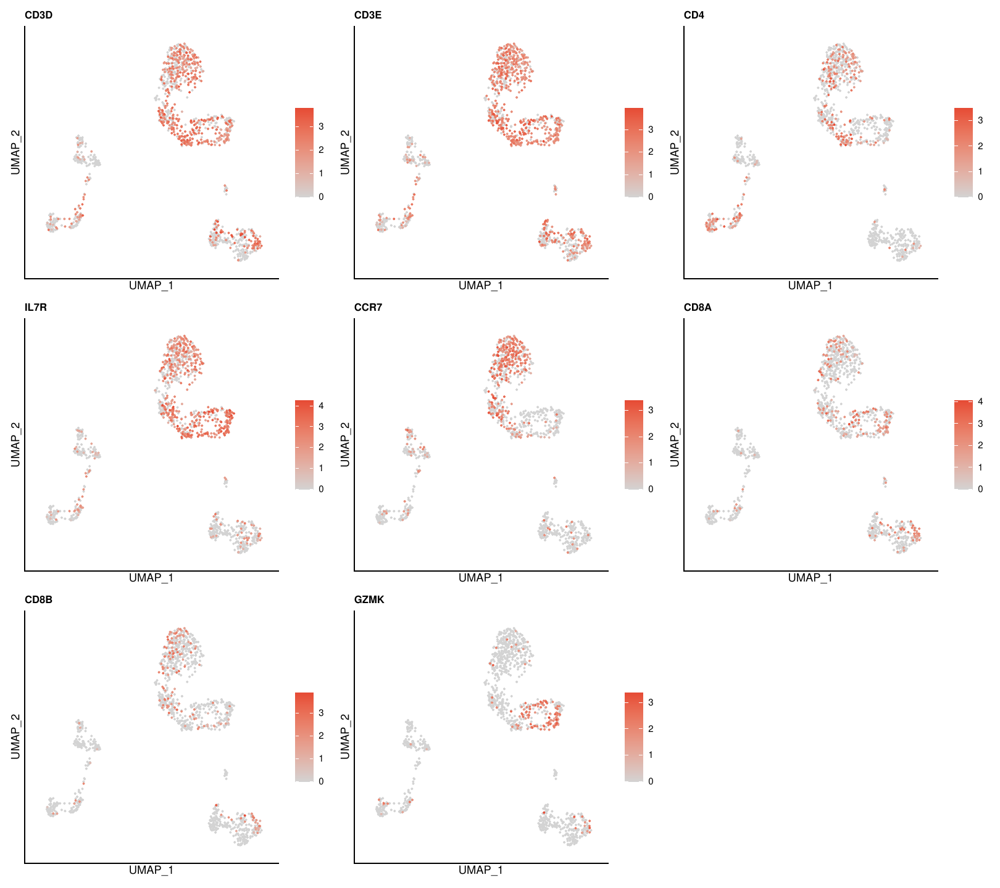

**What it shows:** Canonical marker expression on the integrated UMAP (same as plot 10/15 but for the full merged dataset).

**How to interpret:** With more cells, spatial patterns are sharper. Markers should concentrate in specific regions. Use these alongside the annotation dot plot to verify cluster identities at the integrated level.

---

### 25. Dot Plot — Canonical Markers × Cell Type

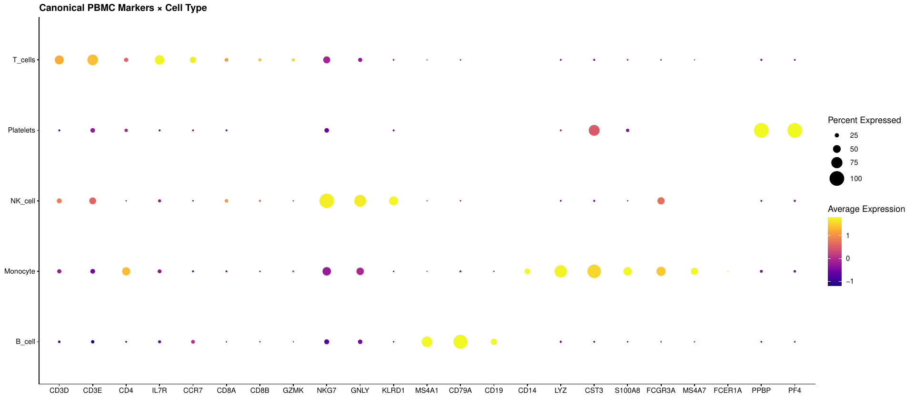

**What it shows:** Canonical PBMC markers plotted against annotated cell types (not clusters). Dot size = % of cells in that type expressing the gene; colour = average expression (plasma scale).

**How to interpret:**
- Good: Each cell type shows high expression of its expected markers and low expression of other lineage markers — a clean diagonal pattern of specificity
- Poor: Many cell types co-express markers from different lineages = annotation may need refinement, or `CLUSTER_CELLTYPE_MAP` assignments need adjustment
- Use this as a validation plot after annotation: it confirms whether the labels are biologically coherent

---

### 26. Heatmap — Top 3 Markers per Cluster

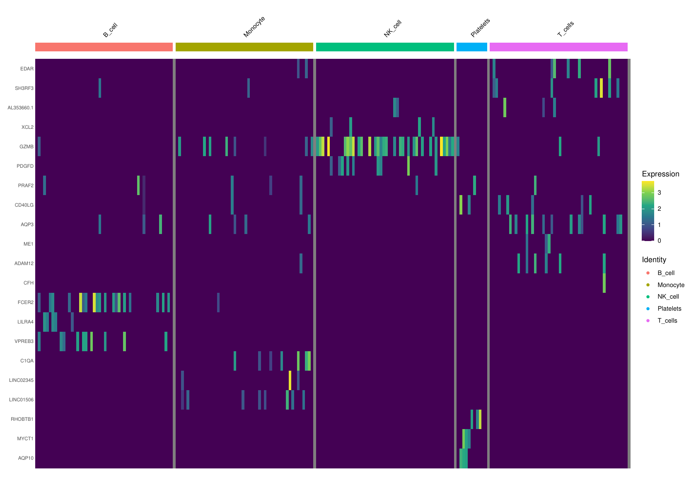

**What it shows:** A heatmap of the top 3 differentially expressed genes per cluster (by log2FC), across a downsampled set of cells (≤50 per cell type). Cells are grouped by annotated cell type; gene expression is log-normalised.

**How to interpret:**
- Good: Clear block structure — each row block (cell type) shows high expression of its own marker genes and low expression of others; distinct colour bands corresponding to each cell type
- Poor: Markers bleed across cell type boundaries = either the annotation is incorrect, or those cell types are transcriptionally similar (e.g. CD4 and CD8 T cells share many genes)
- A cell type block with uniform low expression across all genes = that cell type has no strong markers; it may be a contaminant or an unresolved mixed population

---

### 27. Cell Type Composition — % and Cell Count per Sample

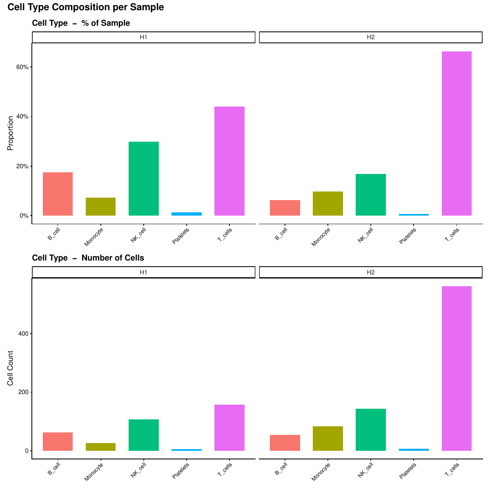

**What it shows:** Stacked bar chart showing proportion (%) of each cell type per sample, with each segment labelled `cell_type XX%` for segments ≥2%.

**How to interpret:**
- Good: Similar proportions across samples for expected stable populations (e.g. T cells ~60–70% of PBMC); minor variation between donors is normal
- Biological differences: A sample with unusually high monocyte % may indicate inflammation or infection in that donor
- Technical differences: If one sample has very few cells of all types compared to another, check QC metrics — the sample may have been under-loaded or over-filtered
- Unlabelled segments (<2%) are present but too small to annotate; check the absolute count panel for their exact numbers

> **Label source:** when a frozen reference is configured (step 05r), these bars use the
> run-independent `cell_type_ref` labels and the subtitle reads `Labels: frozen reference`;
> otherwise they use the de-novo `cell_type` (`Labels: de-novo`). On cross-species runs the
> two can differ sharply (e.g. de-novo can mislabel bat neutrophils as CD14+ Mono). See the
> "Frozen-reference labels & cross-run benchmark" section below.

---

### 28. Violin Plots — Key Lineage Markers per Cell Type

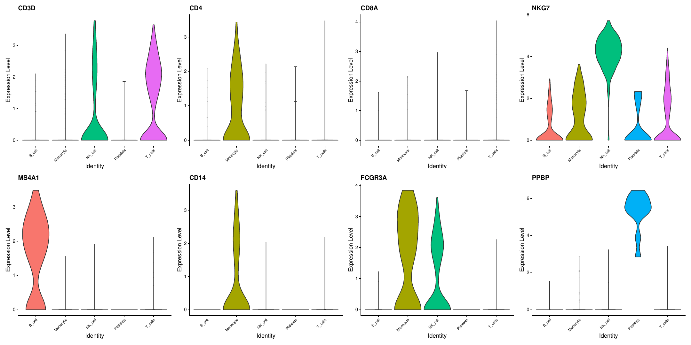

**What it shows:** Expression distribution of 8 key lineage marker genes (CD3D, CD4, CD8A, NKG7, MS4A1, CD14, FCGR3A, PPBP) across annotated cell types.

**How to interpret:**
- Good: Each marker is highly expressed in its expected cell type and near-zero in all others:
  - CD3D → T cells only
  - NKG7 → NK cells (also expressed in cytotoxic T cells)
  - MS4A1 → B cells only
  - CD14 → CD14 Monocytes; FCGR3A → FCGR3A Monocytes
  - PPBP → Platelets only
- Poor: A marker expressed broadly across all cell types = annotation is incorrect, or the wrong cell type labels are assigned
- Bimodal violins within a cell type = that cluster may contain two transcriptionally distinct subpopulations that were merged; consider increasing clustering resolution

---

## 06b — Differential Expression Report

> Generated by `06b_differential.R`. Only produced for multi-sample runs (≥2 samples). Saved to `results_*/differential/`.

---

### 29. Volcano Plots — Sample DE per Cell Type

**What it shows:** One volcano plot per cell type that has ≥20 cells in each sample. X-axis = log2 fold-change (sample1 / sample2); Y-axis = –log10(adjusted p-value). Coloured dots = significantly DE genes (|log2FC| > 0.5, adj. p < 0.05). Top 12 genes by |log2FC| are labelled.

**How to interpret:**
- Good: Most cell types have few or no significant DE genes — donors are biologically similar
- Expected: Some DE in Monocytes (inflammatory state, activation) and NK cells (cytotoxic activity)
- Concern: Large numbers of DE genes in T cells or B cells may indicate immune activation, infection, or strong donor effect
- Many genes DE in all cell types simultaneously = technical batch effect rather than biology; check Harmony mixing quality

**Files saved:**
- `volcano_<CellType>.pdf` — one per testable cell type
- `DE_<CellType>.csv` — full DE table (log2FC, p-value, pct.1, pct.2)
- `DE_all_celltypes.csv` — combined table for all cell types
- `DE_summary.csv` — per-cell-type summary: n_DE, top 3 up/down genes

---

### 30. Module Score Plots — Inflammatory / Interferon / T-Activation Signatures

**What it shows:** Violin + boxplot of gene set module scores per cell type, split by sample. Three signatures scored:

| Signature | Key genes | Interpretation |
|---|---|---|
| **Inflammatory** | TNF, IL1B, IL6, CXCL8, S100A8, S100A9, CCL2–4, IL18 | Innate immune activation; elevated in Monocytes during infection or inflammation |
| **Interferon** | IFIT1–3, ISG15, MX1, OAS1–2, IRF7, CXCL10, STAT1 | Antiviral response; elevated across all cell types during viral infection |
| **T Activation** | IFNG, GZMB, PRF1, TNFRSF4, CD69, IL2RA, HAVCR2 | T cell effector activity / exhaustion; elevated in CD8 T and NK cells |

**How to interpret:**
- Good: Scores near zero in healthy resting PBMC; slight elevation in Monocytes is normal
- Concern (Inflammatory ↑ in Monocytes): donor may have subclinical inflammation, infection, or slow sample processing
- Concern (Interferon ↑ across all cell types): active viral infection, or interferon therapy
- Concern (T Activation ↑ in CD8 T): effector or exhausted T cell state; check HAVCR2 (TIM-3) and PRF1 levels
- Asymmetry between samples: donor biology rather than technical batch — validate with volcano plots

**Files saved:**
- `module_score_Inflammatory.pdf`
- `module_score_Interferon.pdf`
- `module_score_T_Activation.pdf`
- `differential_report.pdf` — all plots combined

---

---

## bootstrap_proportions_report.pdf (Step 09)

> Generated by `09_bootstrap_proportions.R`. Run via `bash run_pipeline.sh <samples> 09`.

Normalises cell type proportion comparisons across samples with different capture depths.

### Plot 1 — Observed Cell Type Proportions (stacked bar)

**What it shows:** Stacked % bar per sample with multinomial 95% CI error bars. Labels shown for segments ≥2%.

**How to interpret:**
- Reflects raw capture-depth-biased proportions — larger samples may appear to have more rare cells simply because they captured more cells
- Error bars = Wilson-score multinomial CI; narrow bars = large n, wide bars = small n (Sample6 CI is wider)
- Use this alongside the bootstrap panel to see how much proportions shift after normalisation

---

### Plot 2 — Bootstrap-Normalised Proportions (stacked bar)

**What it shows:** Same stacked bar but after 1000× downsampling all samples to the smallest n (n_min). Removes capture-depth bias.

**How to interpret:**
- Good: Proportions close to observed = capture depth was adequate; normalisation doesn't shift the estimate significantly
- Different from observed: the sample with more cells had a biased proportion estimate; trust the bootstrap value for cross-sample comparison
- Note: bootstrap mean ≈ observed proportion (point estimate converges); the value is in equalised depth for fair comparison, not a shifted mean

---

### Plot 3 — Bootstrap 95% CI per Cell Type × Sample (faceted dot plot)

**What it shows:** One facet per cell type. Dot = bootstrap mean proportion per sample; error bars = 2.5th–97.5th percentile of 1000 draws.

**How to interpret:**
- Non-overlapping CIs between samples = statistically distinguishable proportions at this depth
- Wide CIs for rare cell types in small samples = insufficient depth to estimate that population reliably
- Sample with collapsed CI (no error bar) = that sample IS n_min; bootstrap of its own data gives no variance (use multinomial CI from Plot 1 instead)

---

### Plot 4 — Pairwise Chi-squared Test (tile heatmap)

**What it shows:** All pairwise sample combinations tested for overall composition differences (chi-squared on observed cell counts). Tile colour = p-value (red = significant, blue = not significant).

**How to interpret:**
- p < 0.05 (red tiles) = compositions are significantly different between that pair
- All pairs significant = each bat individual has a genuinely different immune cell composition — consistent with published inter-individual variation in bat whole blood
- All pairs non-significant = compositions are similar; differences in stacked bars are within sampling noise

---

## rarefaction_report.pdf (Step 10)

> Generated by `10_rarefaction.R`. Run via `bash run_pipeline.sh <samples> 10`.

Empirically determines the minimum capture depth needed for stable cell type proportion estimates.

### Plot 1 — CI Width vs Capture Depth (all cell types)

**What it shows:** 95% bootstrap CI width (y) vs number of captured cells (x) per cell type. Solid lines = empirical; dashed lines = theoretical a/√n. Dotted vertical line = smallest sample in current run.

**How to interpret:**
- All lines decrease as n increases (expected — more cells = narrower CI)
- The gap between solid and dashed = how close empirical CI is to theoretical; they should track closely
- Where the smallest sample line intersects each cell type curve = the actual CI precision for that sample
- Rare cell types (DC, B cell, NK) have wider CIs at any given n — they require more cells for the same precision

---

### Plot 2 — RMSE vs Capture Depth

**What it shows:** Root mean squared error of proportion estimates vs ground truth (full largest sample) at each subsampling depth.

**How to interpret:**
- Good: RMSE approaches zero as n increases — estimates converge to ground truth
- High RMSE at low n = estimates are unreliable; the proportion you observe could be far from the true value
- Use this plot to identify the depth at which RMSE becomes acceptably small for your study question

---

### Plot 3 — Faceted CI Width per Cell Type (with convergence threshold)

**What it shows:** One facet per cell type. Solid = empirical CI width; grey dashed = theoretical; red dot-dash = convergence threshold (depth where CI ≤ 2× asymptotic CI); dotted = current smallest sample depth.

**How to interpret:**
- Red line to the left of the dotted line = current smallest sample exceeds the minimum needed for that cell type ✓
- Red line to the right of the dotted line = current smallest sample is below the minimum; CIs are still wide ⚠️
- The convergence threshold is the practical minimum capture depth per cell type

---

### Plot 4 — Minimum n Summary Table

**What it shows:** Table of recommended minimum capture depth per cell type, sorted from most demanding to least.

**How to interpret:**
- The most demanding cell type determines the overall minimum (typically the dominant population, e.g. Monocyte, because a 1% absolute error on a 70% population requires more cells than 1% on a 5% population)
- Use this table when designing future experiments to set per-sample capture targets

---

## Comparison_report.pdf (Step 08)

> Generated by `08_comparison_report.R`. Requires a multi-sample run. Run via `bash run_pipeline.sh <samples> 08`.

This standalone report consolidates the most diagnostically useful cross-sample comparisons into a single document for sharing or archiving.

### Sections

| Section | Key plots / tables |
|---------|--------------------|
| Cover | Sample names, run date, pipeline version |
| Sample Quality & Cell Fate | `cell_fate.csv` table (input → QC → doublet → final cells per sample), QC violin plots, QC scatter plots |
| Doublet Rates | Doublet UMAP + score histogram per sample |
| Cell Type Composition | Stacked % bar + absolute count bar |
| Integrated UMAP | All pages of split-by-sample UMAP (≤2 panels/page) |
| Key Marker Expression | Canonical markers dot plot, key lineage violin plots |

**How to use:**
- Share as a self-contained QC + analysis summary without requiring access to the full results directory
- Use the Cell Fate table to quickly spot samples with unusually high QC or doublet loss rates
- Use the Composition section to compare cell type proportions across donors before deeper DE analysis

---

## Frozen-reference labels & cross-run benchmark

These appear only when a run was processed with a frozen reference configured
(`SCRNA_REFERENCE_MODEL`; steps 05r + 08c). They make labels run-independent and let shared
anchor samples act as a reproducibility control across runs.

### Two label columns: `cell_type` vs `cell_type_ref`

- **`cell_type`** (de-novo) is computed within the run: cluster, then SingleR/scType consensus.
  It is run-relative, so the same sample can get different proportions in different runs, and on
  cross-species data it can mislabel (bat neutrophils land on the human Neutrophil/Monocyte
  boundary and collapse into CD14+ Mono).
- **`cell_type_ref`** (frozen reference) is transferred from a fixed model that does not depend
  on the run's sample mix. It is the correct view for cross-species work and for comparing the
  same sample across runs.

In the **HTML report**, the composition / cell-number bars and the UMAP default to
`cell_type_ref` with a **Frozen reference vs De-novo** toggle (top of Cell proportions); the UMAP
hover shows both calls. In the **PDFs** (`06`, `09`) the proportion subtitle records which is in
use. If you see neutrophils in the frozen-reference view but not the de-novo view, the de-novo
call was the artifact, not the frozen one.

### `benchmark/benchmark_report.md` (step 08c)

- **Verdict** — PASS when every anchor's drift vs the frozen baseline is within the threshold
  (default 5 pp). Drift is a pipeline/run artifact, not biology, because the input and the model
  are identical across runs.
- **Concordance** (`concordance.csv`) — per anchor × cell type: this run's % vs baseline % vs
  delta, with a DRIFT flag on large gaps.
- **Whole-blood signature** (`wholeblood_signature.csv`) — per-sample Neutrophil / RBC / Platelet
  %. High values together indicate presort / whole blood; depleted values indicate postsort PBMC.
- **Caveats** — the report flags collection-method outliers (e.g. a cardiac-puncture sample that
  reads low-neutrophil / high-lymphoid) so anchor composition is not misread as biology.

> Two anchor samples are a reproducibility control (a fixed point checked across runs), not a
> biological population benchmark (no variance, cannot generalise).

---

## General Interpretation Principles

| Observation | Likely cause | Action |
|-------------|-------------|--------|
| Very few cells after QC (<100) | Thresholds too strict, or poor-quality library | Relax `QC$min_features` / `QC$max_percent_mt` |
| No clear UMAP structure | Too few PCs, or over-filtering | Increase `DIM$dims_use`; check elbow plot |
| Too many clusters (>20 for PBMC) | Resolution too high | Lower `CLUSTER$default_res` |
| Samples don't mix after Harmony | Strong batch effect | Increase `HARMONY$theta` (try 3–5) |
| Harmony mixing warning (>80% one sample) | Batch effect or donor-specific cell state | Increase `HARMONY$theta`; check if cluster is biologically real first |
| Many "Unassigned" cells (SingleR) | Reference mismatch | Set `SINGLER_REF <- "MonacoImmune"` in `config.R` for blood samples; use `bat` species keyword for whole-blood bat; check auto-generated map in log and override in `CLUSTER_CELLTYPE_MAP` |
| Only 4–5 cell types (PBMC should have more) | HumanPrimaryCell reference too coarse | Switch to `SINGLER_REF <- "MonacoImmune"` and increase `CLUSTER$default_res` to 0.8–1.0; re-run steps 04–07 |
| CD4 T and CD8 T not separated | Resolution too low or wrong reference | Increase `CLUSTER$default_res`; switch to MonacoImmune which returns separate CD4/CD8 labels |
| Doublet rate >15% | Cell loading too high | Adjust doublet rate in `DOUBLET$doublet_rate` |
| T cell sub-clusters all identical | Resolution too high or T cells not heterogeneous | Lower `SUBCLUSTER$resolution` to 0.6–0.8 |
| CD14 and FCGR3A in same cluster | Monocyte subtypes unresolved | Increase `CLUSTER$default_res` to 0.6–0.8; re-run steps 04–07 |
| DC absent in annotation | Normal for small/healthy PBMC | No action needed; confirm with FCER1A/CLEC9A feature plots |
| Many DE genes in all cell types | Technical batch effect | Check Harmony mixing; consider increasing `HARMONY$theta` |
| Inflammatory score elevated in one sample | Donor inflammation or slow sample processing | Cross-check with neutrophil cluster presence and CD14 monocyte proportion |
| Interferon score elevated across all cells | Active viral infection or interferon treatment | Note in sample metadata; may confound cell type annotation |
| Neutrophil cells on UMAP | Inflamed donor or slow sample processing (RT lysis) | Compare counts across samples; check with contamination summary plot |
| RBC / Erythrocyte cells on UMAP | Failed or incomplete Ficoll gradient | Repeat isolation; or filter HBB/HBA1-high cells in QC |
| HSPC (CD34+) cells on UMAP | Sample is not pure PBMC (BM aspirate or G-CSF mobilised) | Confirm with CD34 feature plot; exclude if not relevant to study |
| Platelet cluster large (>5%) | Platelet aggregation during PBMC isolation | Expected contamination; exclude Platelet cluster from DE if needed |
